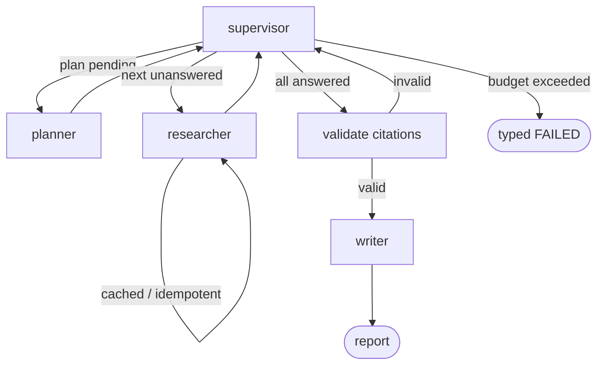

# Multi-Agent Research Assistant

**Problem:** Single-shot LLM answers hallucinate and can't be trusted for research. This system decomposes a question into sub-questions, researches each with real web search, validates every citation, and synthesizes a cited Markdown report — with crash recovery, idempotency, and typed failure modes throughout.

**Implementation:** Python · LangGraph (supervisor graph) · FastAPI · Redis (registry + checkpointer) · Groq (`openai/gpt-oss-20b`) · Tavily search · Docker.

**Architecture:**



**Measured results** (raw files in `bench/results/`):

| Benchmark | Runs | p50 latency | p95 latency | Citation pass | Cost |
|---|---|---|---|---|---|
| Deterministic/Stub | 5/5 | 0.06 s | 0.08 s | 100% | $0.00 |
| Real: Groq gpt-oss-20b + Tavily | _in progress_ | _TBD_ | _TBD_ | _TBD_ | _TBD_ |

**Durability:** `kill -9` mid-run → fresh worker resumes from Redis checkpoint in 8.5 s, zero duplicated side-effects, run completes. (`tests/integration/test_kill_resume.py`)

**Demo:** `demo/e2e_report.md` — real report produced via `curl` → FastAPI → Redis → worker.

---

## Why this exists

LLM research assistants fail in production for boring reasons: duplicated tool calls after restarts, uncited claims, unbounded token spend, and crashes that lose work. This project is a portfolio-grade implementation that treats each of those as a first-class engineering problem:

- **Exactly-once side effects** via idempotency keys (research node cache).
- **Crash recovery** via Redis checkpointer + `BRPOPLPUSH` work queue with orphan reclamation.
- **Citation integrity** via a dedicated validate node that fails the run on invalid citations.
- **Bounded cost** via token/search/sub-question/revision/wall-clock budgets enforced by the supervisor.

## How it works

1. `POST /research` enqueues a run (Redis list). Returns `run_id` immediately.
2. The background worker claims the run (`BRPOPLPUSH` → `processing` list, at-most-once delivery).
3. The LangGraph supervisor loop runs:
   - **planner**: decomposes the question into sub-questions (Groq structured JSON).
   - **researcher**: Tavily search per sub-question; results cached by idempotency key.
   - **supervisor** (deterministic): routes to next unanswered sub-question, or to validate/write when done, or fails the run when budgets are exceeded.
   - **validate**: every citation URL must resolve to a collected finding; invalid → retry or typed failure.
   - **writer**: synthesizes the final Markdown report with citations.
4. `GET /research/{run_id}` polls status; `GET /research/{run_id}/trace` returns the full execution trace.

## Key engineering decisions

| Decision | Why |
|---|---|
| Deterministic supervisor (not LLM-routed) | Routing is a state machine over plan status; an LLM router adds latency, cost, and nondeterminism for zero benefit. |
| Redis for registry + checkpointer | Single source of truth for runs and LangGraph checkpoints; survives worker death. File backend exists for offline tests only. |
| `BRPOPLPUSH` work queue | Atomic claim; crashed workers leave items in `processing`, reclaimed on restart. No message loss, no double-delivery. |
| Idempotency-keyed research cache | Node re-execution (retry, resume) never re-runs searches or duplicates findings. |
| Status normalizer on `SubQuestion` | Real LLMs emit `unanswered`, `unstarted`, `done`…; normalizing beats failing the run. |
| Groq retry: 5 attempts, exp backoff to 60 s | Honors 429 `Retry-After`; TPM limits are the binding constraint on throughput. |
| File registry/checkpointer | Offline-test fallback only; queue ops are not cross-process-atomic. Labeled as such. |

## Evaluation / Benchmarks

`bench/run_bench.py` runs fixed topics end-to-end and writes raw JSON to `bench/results/`.

- **Deterministic/Stub** (`bench_stub_*.json`): 5 topics, 5/5 completed, p50 0.06 s, p95 0.08 s, 6.0 searches/run, citation pass 100%, $0.00.
- **Real Provider: Groq openai/gpt-oss-20b + Tavily** (`bench_real_*.json`): _TBD — see raw file._
- Cost math uses published Groq pricing ($0.075/1M input, $0.30/1M output tokens); Tavily is usage-credit based and reported as searches/run.

## Results

_TBD after real benchmark completes — all numbers traceable to `bench/results/`._

## Failure cases (tested)

- Token/search/sub-question budget exceeded → typed `FAILED` (no hang).
- Provider 429/5xx → retry with backoff → typed failure after exhaustion.
- Invalid citations → validate node fails the run; writer never emits uncited claims.
- No usable sources → researcher marks `insufficient`, supervisor retries or fails typed.
- Worker `kill -9` mid-run → resume from checkpoint, no duplicate side-effects.
- Redis unavailable → `/ready` returns 503; worker backs off instead of crashing.

## What didn't work

- **Docker Compose launch**: no Docker daemon on this machine; `docker-compose.yml` is validated statically only (`docker compose config`).
- **First kill/resume attempt**: duplicate execution after restart (orphan re-queued *and* driven directly; terminal runs re-driven). Fixed: reclaim without re-queue, terminal-run guard, idempotent replay.
- **Groq structured output**: the model emits status synonyms (`unanswered`, `unstarted`); strict enum validation failed runs until the normalizer was added.
- **Groq TPM rate limits**: 8000 TPM on the dev tier; the benchmark paces topics 45 s apart and the provider backs off to 60 s.

## Trade-offs

- Supervisor determinism vs. LLM flexibility: we chose determinism; a future `revise` loop could use the LLM for plan repair.
- Redis as single dependency: simpler than Postgres+queue, but no SQL analytics over runs.
- Wall-clock backstop checks between graph steps only; a hung provider call relies on HTTP timeouts.
- `updated_at` on snapshots is write-time, not a meaningful event timestamp.

## Running locally

```bash
python -m venv .venv && source .venv/bin/activate
pip install -r requirements.txt
cp .env.example .env   # add GROQ_API_KEY / TAVILY_API_KEY, or use Secure Vault
redis-server &

# API + worker (separate terminals)
uvicorn app.main:app --port 8000
python -m app.workers.runner

# Submit research
curl -X POST localhost:8000/research \
  -H 'Content-Type: application/json' \
  -d '{"question": "How do vector databases power RAG?"}'
# → {"run_id": "run_..."}
curl localhost:8000/research/run_.../trace
```

With Docker (daemon required):

```bash
docker compose up --build
```

## API

| Method | Path | Description |
|---|---|---|
| `POST` | `/research` | Enqueue a research run → `{run_id}` |
| `GET` | `/research/{run_id}` | Status, report, usage, cost |
| `GET` | `/research/{run_id}/trace` | Full node execution trace |
| `GET` | `/health` | Liveness |
| `GET` | `/ready` | Readiness (200 / 503 with Redis state) |

OpenAPI: `/openapi.json`.

## Demo

- `demo/e2e_report.md` — real Markdown report from a live API+worker run.
- `demo/e2e_result.json` — full `GET /research/{id}` payload.
- `demo/e2e_trace.json` — node-by-node execution trace.

## Future improvements

- Streaming progress over SSE/WebSocket during research.
- Postgres-backed run history with analytics.
- Plan-repair loop: LLM revises the plan when citations fail validation.
- Multi-worker horizontal scaling benchmarks.
- Eval harness (Project 3 consumes `eval/sample_outputs.jsonl`).

---

_All numbers above are measured from committed raw files in `bench/results/`. No synthetic benchmarks._
